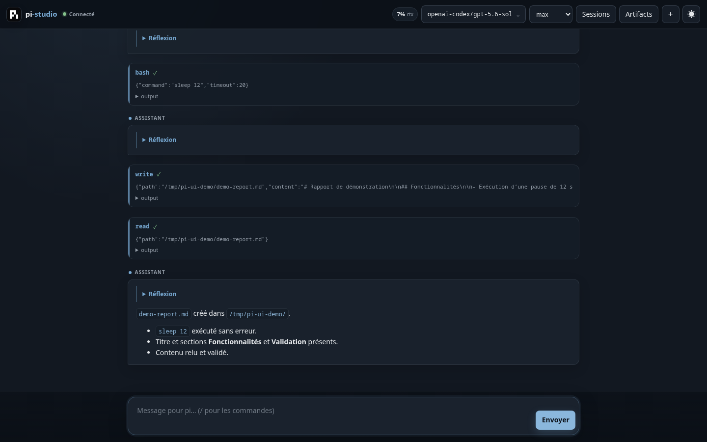
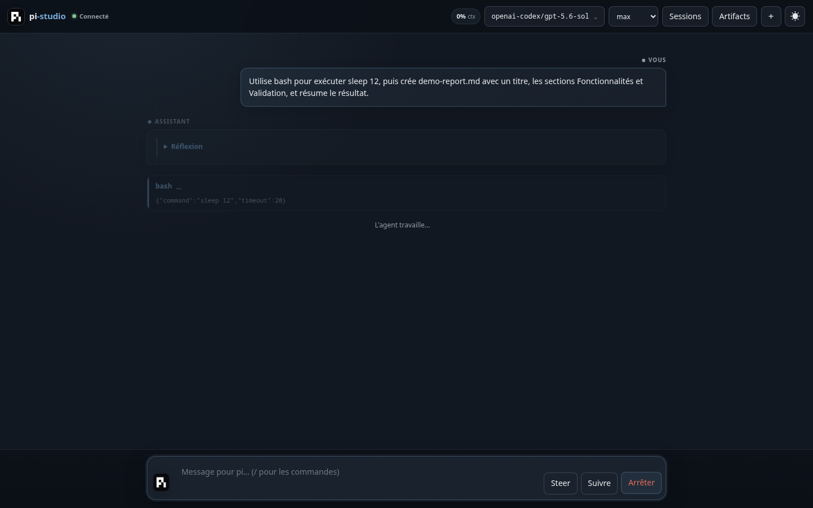
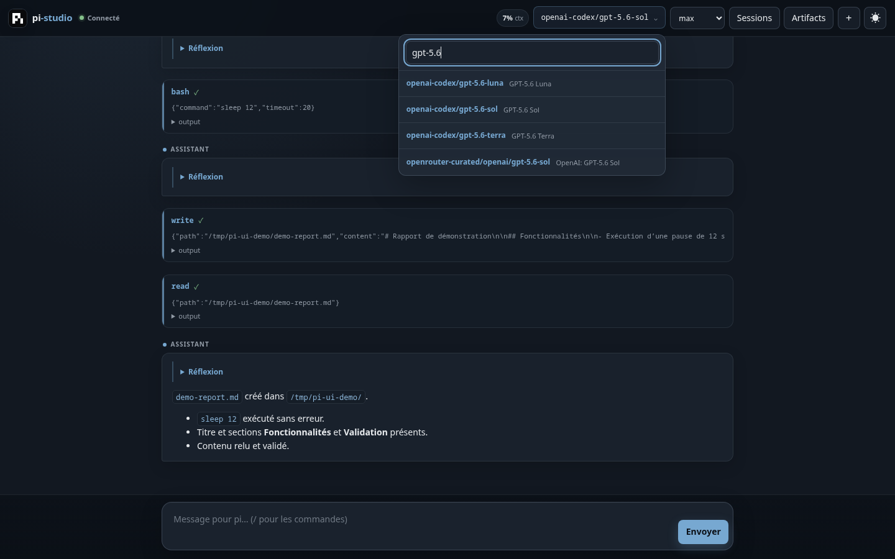
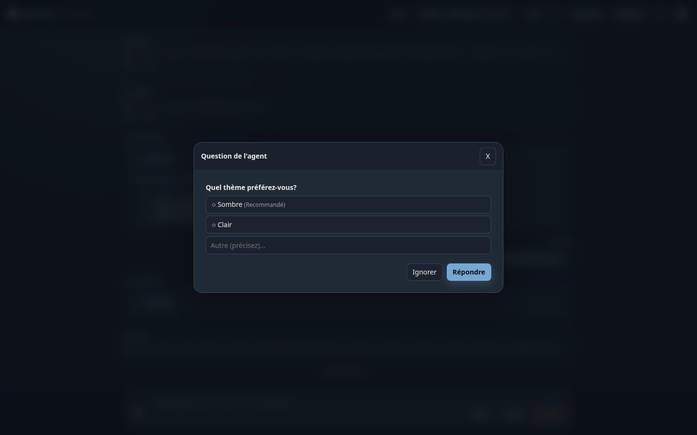
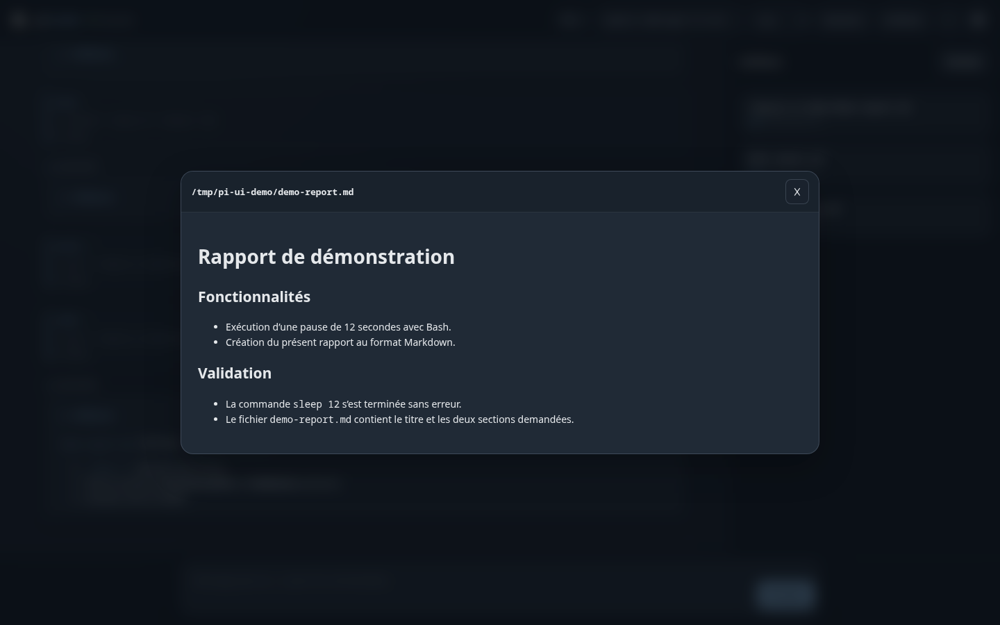
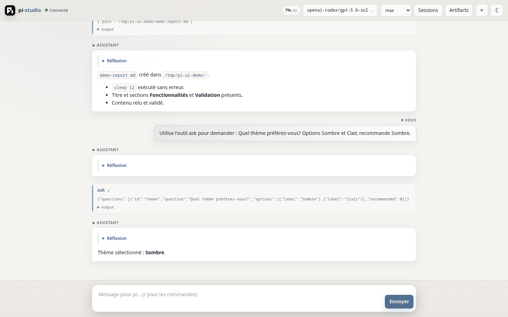

# pi-studio

A web interface for [Pi](https://pi.dev) (the minimal coding agent harness), distributed as a pi package. Chat with pi from your browser: streaming, slash commands, model & thinking pickers, session management, and an artifacts pane — branded with pi's look and feel.

> 🇫🇷 [Version française](README.fr.md)

 



## Features

- **Full chat** with streaming (`text_delta`, collapsible thinking blocks, tool call cards)
- **Slash commands** — `/` opens autocomplete (`pi.getCommands()`); `/skill:*` and prompt templates are expanded by the bridge; extension commands from other packages must be run in the TUI (v1 limitation)
- **Ask tool in the browser** — with the web-aware pi-ask-tool fork, structured questions are answered right in the web UI
- **Model picker** (all authenticated models) and **thinking level** selector (`off` → `max`)
- **Sessions**: list past sessions, resume, new, fork from any message
- **Artifacts pane**: files touched by pi (write/edit/read), markdown preview, edit diffs, image preview
- **Responsive dark / light interface** using the [pi.dev](https://pi.dev) palette, polished for desktop and mobile
- **i18n-ready** UI (French locale included)
- **Local-first security**: random per-start token in the URL + WebSocket `Origin` check

## Install

Requirements: Pi, Git, and Node.js 20+.

### Linux / macOS (recommended)

Download and inspect the installer before running it:

```bash
curl -fsSL https://raw.githubusercontent.com/erfinfo/pi-studio/main/scripts/install.sh -o install-pi-studio.sh
less install-pi-studio.sh
chmod +x install-pi-studio.sh
./install-pi-studio.sh
```

### Windows PowerShell

```powershell
Invoke-WebRequest https://raw.githubusercontent.com/erfinfo/pi-studio/main/scripts/install.ps1 -OutFile install-pi-studio.ps1
Get-Content .\install-pi-studio.ps1
powershell -ExecutionPolicy Bypass -File .\install-pi-studio.ps1
```

Both installers support:

| Option | Description |
|---|---|
| `-h`, `--help` | Show built-in help |
| `--ref REF` | Install a branch, tag, or commit (`main` by default) |
| `--no-ask` | Skip the web-aware Ask extension |
| `--launch` | Launch Pi and `/webui` after installation |
| `--port PORT` | Select the web server port (4173 by default) |
| `--lan` | Bind to `0.0.0.0` — read the security warning below |

Example:

```bash
./install-pi-studio.sh --launch --port 8080
```

### Manual install

```bash
# Optional but required for Ask dialogs in the browser
pi install git:github.com/erfinfo/pi-ask-tool@main

pi install git:github.com/erfinfo/pi-studio@main
```

## Usage

Inside pi:

```
/webui                # start the server (127.0.0.1:4173) and open the browser
/webui --port 8080    # custom port
/webui --lan          # bind 0.0.0.0 — share the FULL printed URL (it contains the token)
/webui --no-open      # don't open the browser
/studio               # alias
```

**Interactive questions (ask tool)**: with the web-aware fork [erfinfo/pi-ask-tool](https://github.com/erfinfo/pi-ask-tool), `ask` questions appear directly in the web UI (the question is published on pi's shared event bus; TUI and web race to answer — first wins). Other extensions' dialogs (permission prompts, etc.) still appear in the TUI.

## Screenshots

| Agent working (dark) | Model search |
|---|---|
|  |  |

| Ask dialog | Artifact preview |
|---|---|
|  |  |



All screenshots come from an isolated demo project and contain no private session data.

## Security model

- Binds `127.0.0.1` by default. `--lan` binds `0.0.0.0`.
- A random token is generated on every start and embedded in the auto-opened URL — no password to type, but web pages you visit can't drive the agent (browsers don't apply same-origin policy to WebSockets; the token + `Origin` check close that hole).
- Anyone with the full URL has full agent access (bash, files). Treat the URL like a password, especially with `--lan`.

## Compatibility

Tested with pi **0.81.1** (API is pre-1.0). Node ≥ 20.

## Development

```bash
git clone https://github.com/erfinfo/pi-studio
cd pi-studio
npm install
cd web && npm install && npm run build   # builds web/dist (committed)
cd ..

# try without installing:
pi -e ./pi-studio
# then in pi: /webui
```

- `npm run typecheck` — backend types
- `npm test` — vitest unit tests
- `web/dist` is **committed** (pi installs packages with `npm install --omit=dev`); CI checks it is fresh

### Manual smoke checklist

1. `pi -e .` then `/webui` → browser opens, chat loads
2. Send a prompt → streaming text appears
3. `/` in the composer → autocomplete lists commands; `/skill:<name>` expands
4. Change model and thinking level → reflected in pi
5. Sessions panel → resume an old session
6. Ask pi to create a `.md` file → appears in Artifacts with preview
7. Toggle dark/light theme

## How it works

The package registers a `/webui` command. The command starts an HTTP + WebSocket server **inside the pi process** and bridges the web UI to pi's extension API: session events (`message_update`, `tool_execution_*`, …) are streamed to the browser; the browser sends actions (`sendUserMessage`, `setModel`, `setThinkingLevel`, session control via the command context). The server is a singleton that survives session replacement (`/new`, `/resume`, `/fork`); the command context is re-stashed via `withSession` after each replacement.

## License

MIT — see [LICENSE](LICENSE). The pi logo and palette come from [pi.dev](https://pi.dev) (earendil-works/pi, MIT).
